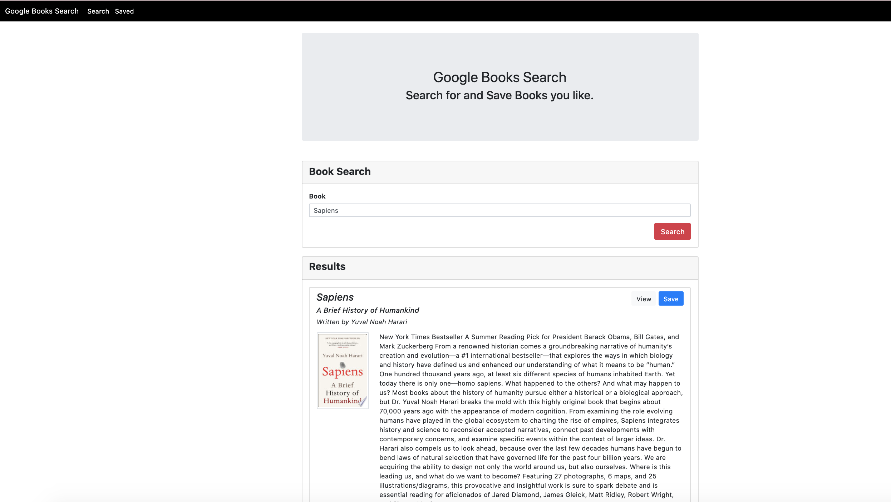
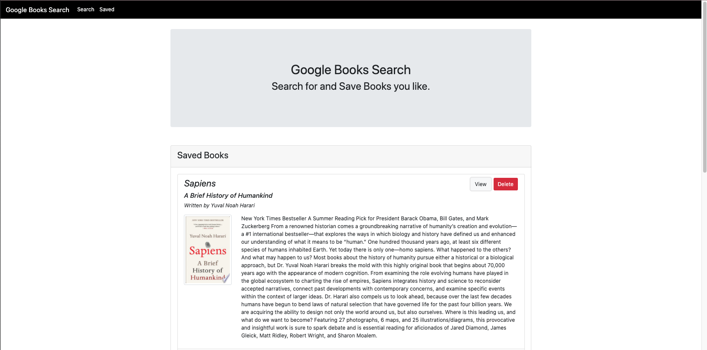
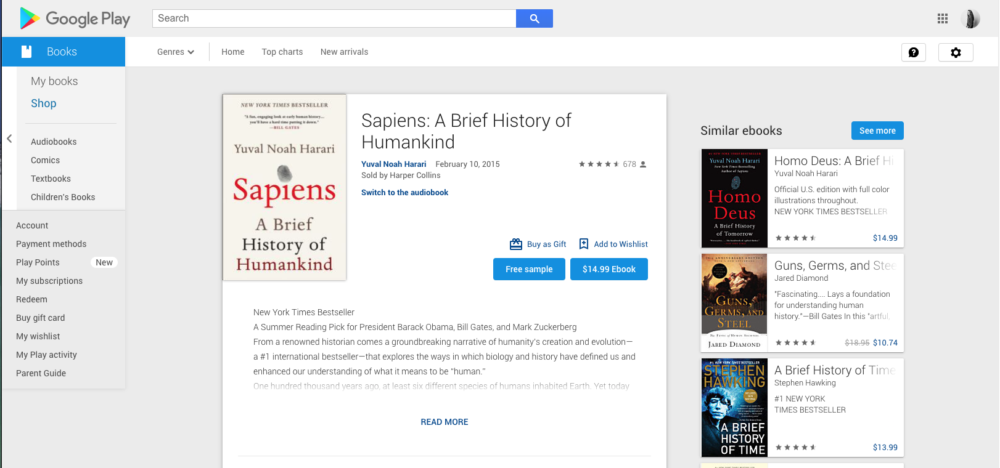

# Google-Books-Search

<b>Deployed on Heroku:</b> 
https://books-app-search.herokuapp.com/

A React-based Google Books Search app. Users can search for books by title or author and save books to review later. 

<b>Search</b> - User can search for books via the Google Books API and render them here. User has the option to "View" a book, bringing them to the book on Google Books, or "Save" a book, saving it to the Mongo database.

<b>Saved</b> - User can see a list of their saved books to create a reading list. They can "view" more about the book on Google Play and "delete" the book from the list once they're done, removing it from the Mongo database.

<b>Technology:</b>
- React
- Node
- Express
- MongoDB
- Bootstrap

<b>More info:</b> 
Start by using the 07-Ins_Mern example as a base for your application.

Add code to connect to a MongoDB database named googlebooks using the mongoose npm package.

Using mongoose, then create a Book schema.

<b>Fields:</b>

title - Title of the book from the Google Books API

authors - The books's author(s) as returned from the Google Books API

description - The book's description as returned from the Google Books API

image - The Book's thumbnail image as returned from the Google Books API

link - The Book's information link as returned from the Google Books API

